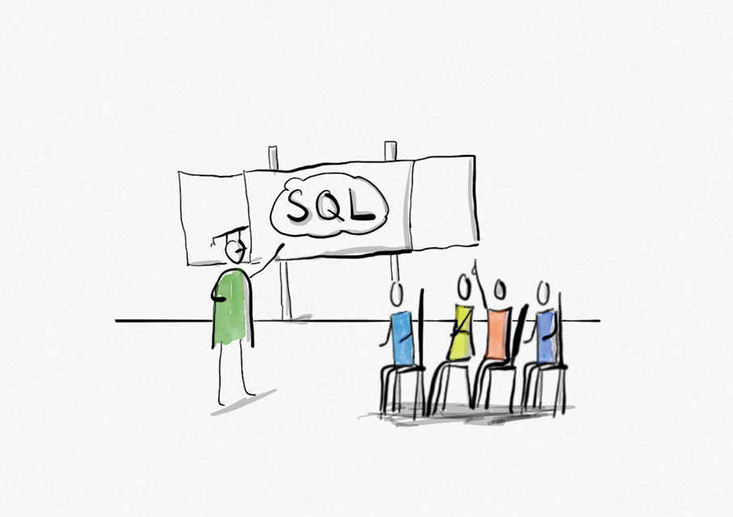

# Index

Diese Dokumentation dient zum Nachschlagen und Lernen von SQLite Befehlen für Schülerinnen und Schüler. 

Die hier aufgeführten SQLite Befehle können mit Hilfe des online SQLite Editors <a href="https://sulkar.github.io/SQLverine/" target="_blank">SQLverine</a> einfach umgesetzt werden.

## Überblick

...

